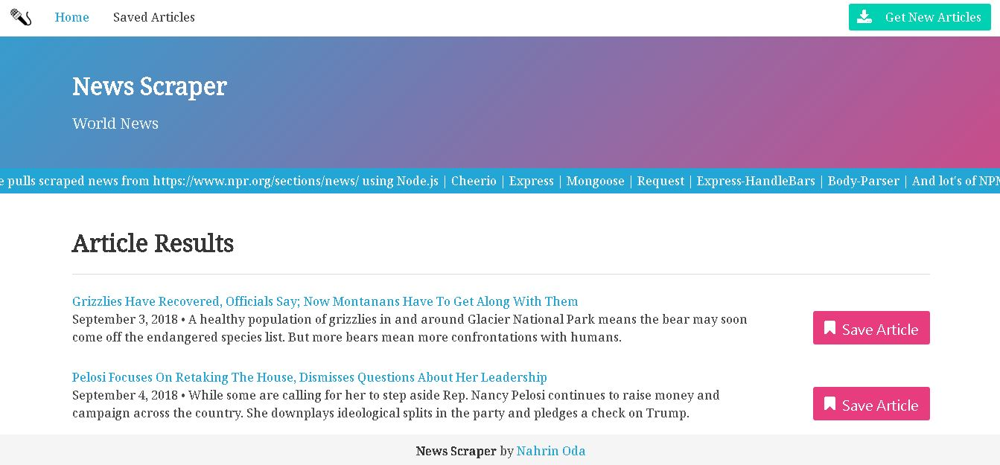
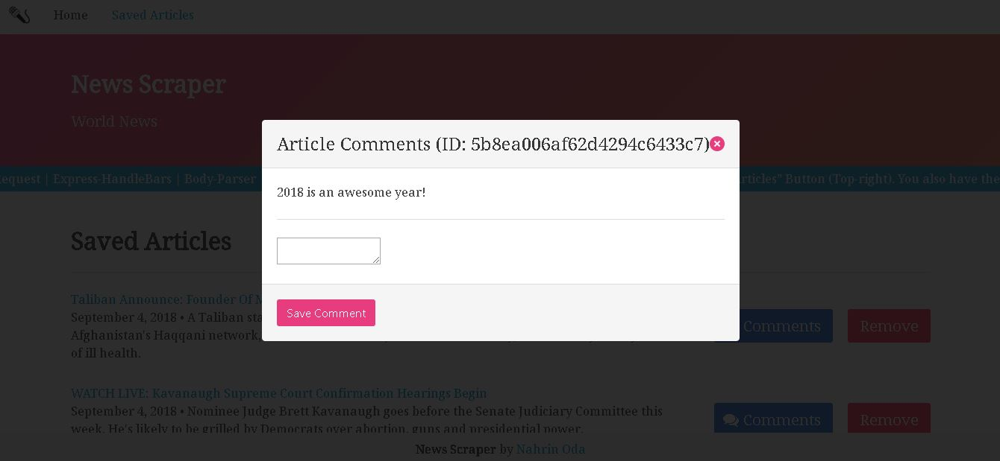

# NPR News Scraper

Welcome to the News Scraper  website.  This website pulls scraped news from https://www.npr.org/sections/news/ using Node.js | Cheerio | Express | Mongoose | Request | Express-HandleBars | Body-Parser | And lot's of NPM love..... You can get the latest news by clicking on the “Get New Articles” Button (Top-right). You also have the option to save your favourite article and comment on it as well…… Happy Scraping!.

[Live Demo](https:)

## Getting Started

These instructions will get you a copy of the project up and running on your local machine for development. I will assume that you already have [Node.js](https://nodejs.org/en/) and [MongoDB](https://www.mongodb.com/) installed locally. See deployment for notes on how to deploy the project on a live system.

1. Install dependencies
2. In your CLI, enter **mongod**
3. In a new CLI window, go to root of directory and enter **node server.js**
4. In browser, navigate to **http://localhost:3000**

### Dependencies

You will need to npm install the following node modules:

1. express
2. express-handlebars
3. mongoose
4. body-parser
5. cheerio
6. request

Since I have included a package.json file, you do not need to install dependencies by name. Simply run the following in the root of your directory:

```
npm install
```

## Deployment

Follow these instructions to deploy your app live on Heroku

Create a heroku app in your project directory
```
heroku create <projectName>
```

Provision mLab MongoDB add-on for your project
```
heroku addons:create mongolab
```

Now your project should be successfully deployed on heroku.

## Screenshots

**Article search home screen**



**Article comments modal**



## Future Updates

1. [ ] Make 'remove' button successfully remove articles from the saved articles page
2. [ ] Polish comment section UI

### Helpful Links

* [MongoDB Documentation](https://docs.mongodb.com/manual/)
* [Mongoose Documentation](http://mongoosejs.com/docs/api.html)
* [Cheerio Documentation](https://github.com/cheeriojs/cheerio)